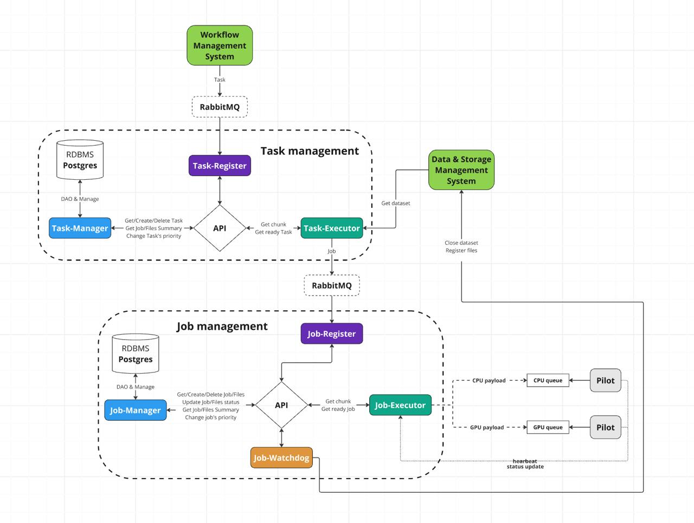

# Распределенная система
## Основная часть
Задача состоит в том, чтобы написать распределённую систему. У нас есть один компьютер, в котором множество nodes. По идее каждый node - ядро. Система должна грузить каждый node (обязательно сделать систему мониторинга), сама реагировать на падение. Нужно писать на С++, так скорость критически важна.
## Скрипты
Условно у нас есть несколько наборов данных, которые мы будем обрабатывать с помощью нашей системы. Пока так: изображение (aka лаба Жасура), дата сет отбор по ключевым словам и еще нужно придумать какую-то задачу с не совсем параллельными процессами, так чтобы была pre и post обработка (посмотрите что-то [тута]([Find Open Datasets and Machine Learning Projects | Kaggle](https://www.kaggle.com/datasets))). На python пишем скрипты, которые будут выполнять nodes.

## Примерная структура

